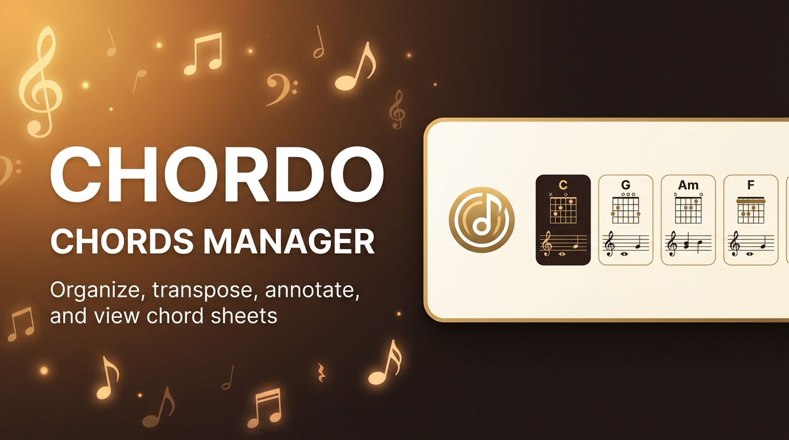

# Chordo: Chords Manager

> Organize, transpose, annotate, and view chord sheets

### Features

- Import Text / ChordPro
- Import Images / PDFs
- Import any URL (auto parse chords/lyrics)
- Create setlists
- Share with others

### Run locally

- `npm install`
- `npm run dev`
